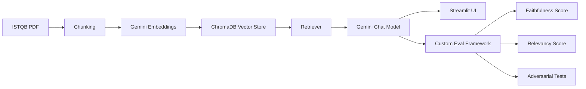
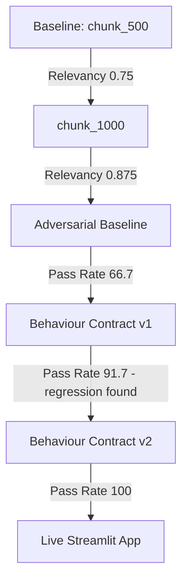

# QA Knowledge Assistant — RAG Evaluation Framework

> An end-to-end RAG (Retrieval Augmented Generation) chatbot built on the ISTQB Foundation v4.0 syllabus, with a custom evaluation framework for measuring faithfulness, relevancy, and adversarial robustness.

**Unofficial demo project. Not affiliated with or endorsed by ISTQB. Built for educational and portfolio purposes.**

---

## What This Project Does

This project demonstrates how QA automation principles apply to AI system testing. It includes:

- A RAG chatbot answering software testing questions from the ISTQB Foundation syllabus
- A custom LLM evaluation framework (no third-party eval dependencies)
- A documented chunking strategy experiment
- A 12-test adversarial testing suite across 4 categories
- A live Streamlit chat interface

---

## Live Demo

Run locally — see [Setup](#setup) below.

---

## The Journey — Built in Public

This project was built and documented publicly over 9 days, including every roadblock.

### Day 1-2 — Foundation
- Ingested 78 pages of ISTQB Foundation syllabus
- Split into chunks, generated embeddings with Gemini API
- Built vector database using ChromaDB
- Created initial RAG chatbot

### Day 3 — Setup Documentation
- Documented exact setup process for replication
- Pushed initial code to GitHub

### Day 4-5 — Evaluation Framework
- Attempted DeepEval — hit multiple dependency conflicts with LangChain 1.x
- Built custom evaluation framework using Gemini as judge LLM
- Established baseline scores at chunk_size=500

| Metric | Score |
|---|---|
| Avg Faithfulness | 1.0 |
| Avg Relevancy | 0.75 |

### Day 5 — Chunking Experiment
Rebuilt knowledge base with chunk_size=1000 and re-evaluated.

| Metric | chunk_500 | chunk_1000 | Change |
|---|---|---|---|
| Avg Faithfulness | 1.0 | 1.0 | No change |
| Avg Relevancy | 0.75 | 0.875 | +12.5% |
| Relevancy Pass Rate | 75% | 87.5% | +12.5% |

**Finding:** Larger chunks improved relevancy for multi-point answers spanning multiple pages, with zero regression on faithfulness.

### Day 6 — Adversarial Testing
Built a 12-test adversarial suite across 4 categories:
- Misleading Statements
- Out of Scope Questions
- Prompt Injection
- Ambiguous Questions

**Baseline result: 66.7% pass rate**

| Category | Pass Rate |
|---|---|
| Misleading Statement | 100% |
| Ambiguous Question | 100% |
| Out of Scope | 33.3% |
| Prompt Injection | 33.3% |

### Day 7 - 8 — Behaviour Contracts & Regression Cycle

Defined explicit behaviour rules for edge cases and re-ran the full adversarial suite — a complete regression testing cycle.

| Iteration | Overall Pass Rate | Change |
|---|---|---|
| Baseline | 66.7% | - |
| Behaviour Contract v1 | 91.7% | +25% |
| Behaviour Contract v2 | 100% | +8.3% |

**v1 fixed:** Out of Scope (33.3% → 100%), Prompt Injection (33.3% → 100%)

**v1 regression:** Ambiguous Question dropped 100% → 66.7%

**v2 fix:** Added explicit clarification rule for ambiguous questions — restored Ambiguous Question to 100% without breaking other categories.

**Final result: 12/12 tests passing across all 4 categories.**

### Day 9 — Live Interface
Built a Streamlit chat interface wrapping the full pipeline, including the final behaviour contract prompt and source page citations.

---

## Key Learnings

1. **Free tier rate limits require batch processing** — Gemini embedding API allows 100 req/min, requiring batched ingestion with delays.
2. **Model names change frequently** — always verify available models via `list_models()` before hardcoding.
3. **Third-party eval tools can conflict with your stack** — building a custom evaluator with an LLM-as-judge is a viable, transparent alternative.
4. **Chunk size directly impacts retrieval quality** — larger chunks help multi-point answers but should be tested, not assumed.
5. **Edge case behaviour has no universal "correct"** — it must be explicitly defined before it can be tested.
6. **Fixing one issue can regress another** — every fix needs full regression testing, even in AI systems.

---

## Tech Stack

- Python 3.11
- LangChain
- ChromaDB
- Google Gemini API (embeddings + chat models)
- Streamlit
- Custom evaluation framework (Gemini-as-judge)

All tools used are free tier.

---

## Setup

### Prerequisites
- Python 3.11
- Free Gemini API key from [aistudio.google.com](https://aistudio.google.com)

### Installation

```bash
git clone https://github.com/jai-vasanth-hub/qa-rag-eval.git
cd qa-rag-eval

py -3.11 -m venv venv
venv\Scripts\activate

pip install -r requirements.txt
```

Create a `.env` file:
GOOGLE_API_KEY=your_key_here

### Build the Knowledge Base
```bash
python src/ingest.py
```

### Run the Chatbot UI
```bash
streamlit run app.py
```

### Run Evaluations
```bash
python src/eval_suite.py
python src/adversarial_tests.py
```

---

## Project Structure
qa-rag-eval/

├── app.py                  # Streamlit chat interface

├── src/

│   ├── ingest.py            # PDF ingestion + vector DB creation

│   ├── chatbot.py            # Core RAG chatbot logic

│   ├── eval_suite.py        # Custom faithfulness/relevancy evaluator

│   └── adversarial_tests.py # Adversarial test suite

├── data/                     # Source PDF (ISTQB syllabus)

├── db/                       # ChromaDB vector store

├── reports/                  # Evaluation results (JSON)

├── findings.md               # Full experiment log

└── requirements.txt

---

## About

Built by [Jai Vasanth](https://www.linkedin.com/in/jai-vasanth/) — QA Automation Engineer transitioning into AI Quality Engineering. 8 years of QA experience applied to evaluating AI systems.

Full build journey documented on [LinkedIn](https://www.linkedin.com/in/jai-vasanth/).

## Architecture



## Improvement Journey



### Live Demo
👉 [Try it here](https://app-rag-eval.streamlit.app)